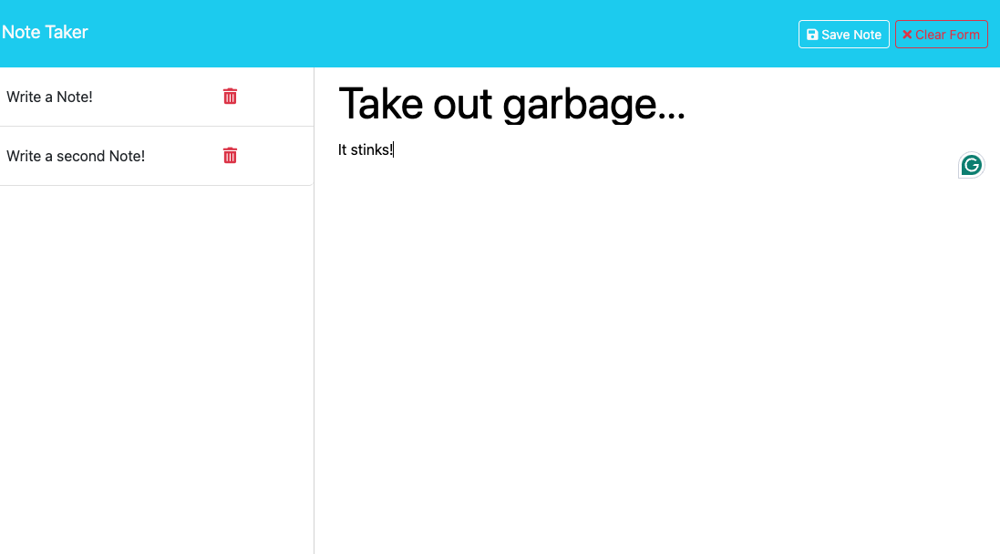

# tamer-express-js-note-taker

## Description 
This application is a note-taking app that uses Express.js to handle the routing by getting the APIs, reads files and posts said files. When the user clicks on "Get Started" they will be taken to a notes HTML which was routed through Express.js. Here the user has the ability to write a note, which will be then posted to the page as a list item. The user can add as many notes as they wish and said notes will remain on the page.

# Table of Contents
- [Installation](#installation)
- [Usage](#usage)
- [Credits](#credits)
- [License](#license)

## Installation
 To use this application, one must first clone the repository from GitHub into their coding software. Once this is done, follow the commands:

To install the necessary dependencies for this application using Express, first start by running this in your command terminal on the server.js file:

`npm install express`

Once this is done, install npm:

`npm install`

This will install all the dependencies listed in for project's package.json file.

Once the necessary packages are installed, run:

`node server.js` 

This will start the application. If you have nodemon installed, run:

`nodemon server.js`

If you wish to use Nodemon (optional), follow the instructions <a href="https://www.npmjs.com/package/nodemon">here</a>.

## Screenshot

## Link
https://protected-fortress-49296-c00509acec21.herokuapp.com/

## Features
<a href="https://expressjs.com/">ExpressJs</a>

<a href="https://nodejs.org/docs/latest/api/
">NodeJs</a>

<a href="https://www.npmjs.com/package/nodemon">Nodemon npm</a>

## Questions
<a href="https://github.com/tamerbekir">My GitHub</a>
 
If you have any questions or inquiries, feel free to contact me using my <a href="mailto:tamerbekir@yahoo.com">email</a>

This README.md was generated by <a href="https://www.linkedin.com/in/tam-b-53815035/">Tamer Bekir</a> using Node.js.

## License

This project is covered under the [MIT License](https://opensource.org/blog/license/mit) License
